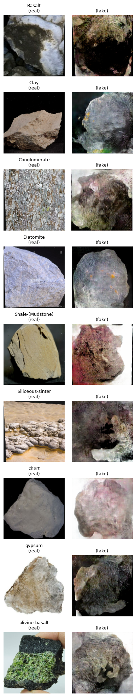

# Rock-GAN

This project implements a Generative Adversarial Network (GAN) for generating synthetic rock images, using **Keras** and **TensorFlow**. A kaggle dataset (https://www.kaggle.com/datasets/stealthtechnologies/rock-classification) is used for the training images with labels.

The objective is to train a conditional Generative Adversarial Network (cGAN) to generate realistic rock images from 9 different classes.




## Model limitations
The cGAN architecture chosen for this project was adequate for the task, however it suffered from a few limitations. It's performance was restricted by the limited size and variability of the training dataset, although augmentations helped with this issue. Training was further restricted by GPU memory limitations, requiring smaller batch sizes and reduced image dimensions that can affect output resolution and convergence stability. Balancing generator–discriminator learning rates was challenging, with the discriminator model dominating in many circumstances, which was helped by increasing the dropout in the discriminator and reducing it's learning rate.

## Justification of Visualisations
Visualisations were chosen to clearly demonstrate both the ability and training progression of the generator for each class. The first visualisation is three generated images for each class as to get an idea of the performance of the generator. Side-by-side comparisons of real and generated images then help assess qualitatively the performance of the generator. Finally, the animated GIFs display how generated samples evolve over epochs. Obtaining quantitative results was challenging due to the lack of suitable metrics, so all visualisations focused on providing results for qualitative assessment.

## Contents
- `Rock_GAN_main.ipynb`: Jupyter notebook containing model architecture, training, and visualisation code.
- `requirements.txt`: List of dependencies for reproducibility.

## Installation
```bash
git clone https://github.com/MatDebLund/Rock-GAN.git
cd Rock-GAN
pip install -r requirements.txt
```
## Usage

Run the jupyter notebook, further explanations can be found inside it.
```bash
jupyter notebook Rock_GAN_main.ipynb
```
